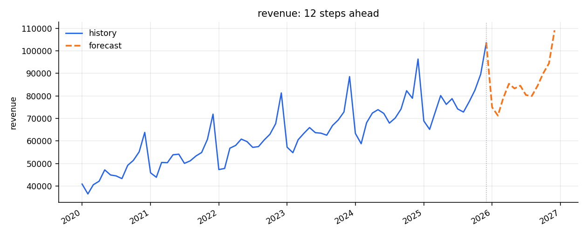
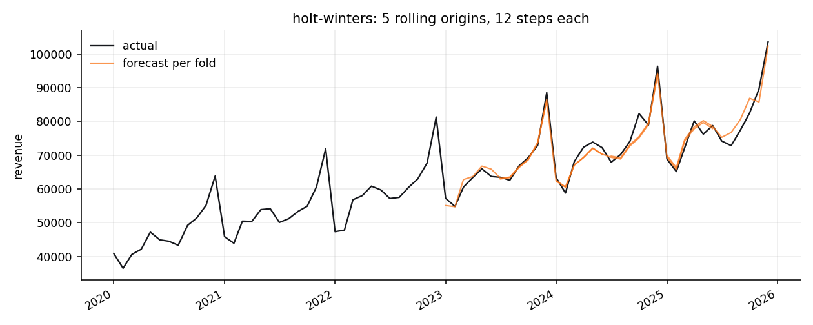

# forecast

[](https://github.com/umer-78/timeseries-forecasting/actions/workflows/ci.yml)

**Live demo:** https://umer-78.github.io/timeseries-forecasting/

Time series forecasting in Python, with no dependencies: baselines, exponential
smoothing, a parameter search, and rolling-origin backtesting that does not lie
to you about how good the model is.

```
$ forecast compare data/monthly-sales.csv -h2 6 --initial 36 --step 3
11 folds x 6 steps, seasonal period 12
model                 MASE         MAE        RMSE    sMAPE
holt-winters         0.275    1,806.07    2,171.40     2.5%  <-- better than the naive baseline
seasonal naive       0.942    6,199.49    6,601.45     9.1%
ses                  1.018    6,698.44    9,397.89     9.1%
holt (damped)        1.278    8,409.47   10,821.72    11.3%
holt                 1.294    8,515.82   11,133.04    11.3%
naive                1.591   10,465.17   13,750.04    13.7%
drift                1.658   10,905.69   14,806.92    14.0%
mean                 2.328   15,314.77   17,386.15    22.9%
```

- **50 tests**, Python 3.10–3.12, no runtime dependencies (matplotlib only for charts)
- Baselines are first-class, because a model that cannot beat "next January looks
  like last January" is not worth running



## Quick start

```bash
git clone https://github.com/umer-78/timeseries-forecasting.git
cd timeseries-forecasting
pip install -e ".[dev]"
pytest -q                                     # 50 tests

forecast describe  data/monthly-sales.csv
forecast compare   data/monthly-sales.csv -h2 6 --initial 36 --step 3
forecast tune      data/monthly-sales.csv -h2 12
forecast predict   data/monthly-sales.csv -h2 6
forecast backtest  data/monthly-sales.csv -h2 6 --initial 36 --sliding
forecast chart     data/monthly-sales.csv -h2 12 --initial 36 -o reports
```

Point it at your own two-column CSV:

```bash
forecast compare my-series.csv --date-column month --value-column units -h2 12
```

## Four things this gets right that are easy to get wrong

**MASE is scaled by the training window, not the test window.** Mean absolute
scaled error divides your error by how well a seasonal naive forecast did *on the
data the model trained on*. Scale it by the test window instead — as plenty of
code does — and the number depends on the thing being measured: a model looks
good simply because the test period was hard for everything. MASE is also the
only measure here that can be averaged across series, because it has no units.

`1.0` means "no better than the baseline". Below 1 is a real improvement.

**Evaluation is rolling origin, not one split.** A single train/test split scores
a model on one arbitrary window, which is how a model that got lucky once reaches
production. `rolling_origin` refits at every cut-off and averages, and a test
proves no fold ever sees data past its own origin:

```python
for window, origin in zip(seen, [20, 24, 28, 32, 36]):
    assert window == series[:origin], "training data leaked past the origin"
```

**Parameters are tuned at the horizon you forecast.** Grid-searching on one-step
error picks a trend term that chases the last observation: excellent next month,
adrift by month twelve. On the sample data, tuning at one step produced a *worse*
held-out year than the defaults; tuning at twelve steps fixed most of the gap.
Both numbers are pinned in a test.

**MAPE is undefined at zero, and says so.** Points with a zero actual are skipped;
if every actual is zero it raises rather than returning an invented number. sMAPE
is reported alongside because it is defined there and bounded at 200%.

## Tuning is not free improvement

```
$ forecast tune data/monthly-sales.csv -h2 12
holt-winters — 216 combinations scored at 12 step(s) ahead
  alpha  0.05
  beta   0.05
  gamma  0.7
  rolling MAE 1,705.52
```

On a clean signal the search is close to exact — it recovers a trend-plus-season
series to within an MAE of 0.01, where hand-picked parameters leave the trend
behind and run low by more with every step. On sixty points of noisy monthly
data, though, 216 combinations is enough to fit the search itself, and here the
defaults generalise better than any of them.

That is stated as a test rather than left as a surprise
(`test_tuning_does_not_always_beat_sensible_defaults`), and it is why `auto`
keeps the seasonal naive baseline on any tie and why `compare` prints the whole
table instead of announcing a winner.

## Models

| Model | What it assumes |
| --- | --- |
| `Naive` | tomorrow is today |
| `SeasonalNaive` | this January is last January — the yardstick |
| `Mean` | no trend at all |
| `Drift` | the line from the first point to the last continues |
| `SimpleExponentialSmoothing` | a level that drifts, no trend |
| `Holt` | level and trend, optionally damped so long horizons flatten |
| `HoltWinters` | level, trend and additive season |

Holt-Winters renormalises its seasonal factors at the end of every season and
hands the mean back to the level. Factors left free to drift compete with the
level for the same signal — the level absorbs the drift, the trend inherits the
bias, and long forecasts run low. A test checks the forecast is unchanged by the
renormalisation, because it is an identifiability fix, not an accuracy one.

## A second series, to show it is not tuned to one file

`data/daily-traffic.csv` is two years of daily sessions with a weekly rhythm. The
period is inferred from the spacing of the dates, not configured:

```
$ forecast describe data/daily-traffic.csv
sessions: 730 observations, 2024-01-01 to 2025-12-30
  seasonal period 7  (inferred)
  min 5,691.00   mean 9,564.70   max 13,117.00
  first 8,632.00   last 12,212.00   change +41.5%

$ forecast compare data/daily-traffic.csv -h2 7 --initial 180 --step 14
39 folds x 7 steps, seasonal period 7
model                 MASE         MAE        RMSE    sMAPE
holt-winters         0.965      395.97      491.79     4.1%  <-- better than the naive baseline
seasonal naive       1.073      440.65      559.41     4.5%
holt (damped)        3.234    1,327.48    1,808.36    14.2%
```

Note how close seasonal naive is here. On daily traffic with a strong weekly
shape and little else, "last Tuesday" is a genuinely hard forecast to beat, and
Holt-Winters only just manages it. A library that hid the baseline would have
made that look like a triumph.



## As a library

```python
from forecast import read_csv, compare, default_models, rolling_origin
from forecast.tune import auto

series = read_csv("data/monthly-sales.csv")

best = auto(series.values, season_length=12, horizon=12)
best.model.predict(12)          # [74978.05, 71277.63, ...]
best.parameters                 # {'alpha': 0.05, 'beta': 0.05, 'gamma': 0.7}

for result in compare(default_models(12), series.values, horizon=6, initial=36, season_length=12):
    print(result.model, result.scores["mase"])
```

## Layout

```
src/forecast/metrics.py    MAE, RMSE, MAPE, sMAPE, MASE
src/forecast/models.py     baselines and exponential smoothing
src/forecast/backtest.py   rolling-origin evaluation
src/forecast/tune.py       grid search, scored at the real horizon
src/forecast/data.py       CSV reading and season inference
src/forecast/plots.py      charts (matplotlib optional)
src/forecast/cli.py        the `forecast` command
data/                      two sample series, regenerated from a fixed seed
tools/make_data.py         the generator; CI fails if the output drifts
tests/                     50 tests
```

## Not included

ARIMA, state-space models, exogenous regressors, prediction intervals,
multivariate series. What is here is the part you should get right before
reaching for any of that: honest evaluation, and a baseline you have to beat.

## Licence

MIT — see [LICENSE](LICENSE).
